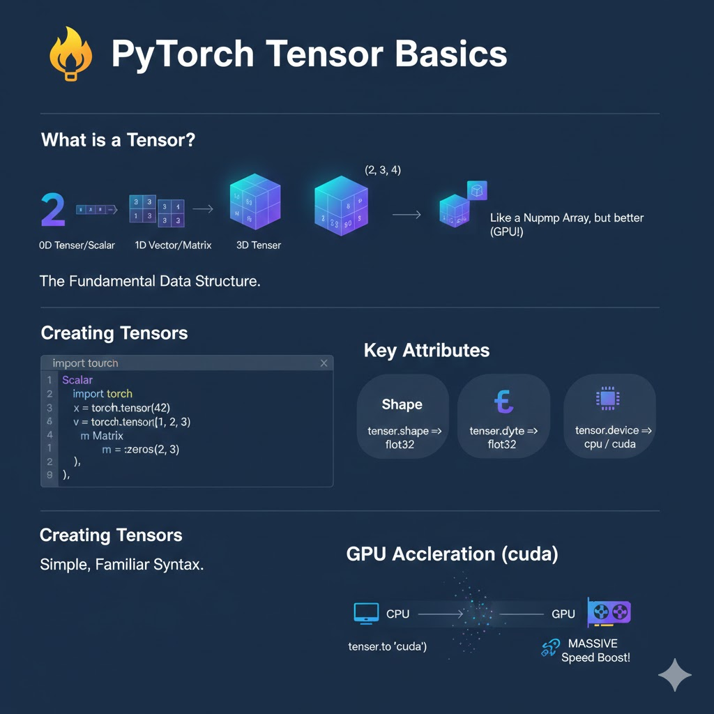

# 🔢 PyTorch Tensor Basics

> **Tensors** are the fundamental building blocks of PyTorch. They are very similar to NumPy arrays, but with a superpower: they can run on **GPUs** to accelerate math by 50x or more!

---

## 🖼️ Visual Architecture



## 🧐 What are Tensors?

A tensor is just a fancy name for a multi-dimensional array:

- **0D Tensor:** A single number (Scalar) -> `5`
- **1D Tensor:** A list of numbers (Vector) -> `[1, 2, 3]`
- **2D Tensor:** A table of numbers (Matrix) -> `[[1,2], [3,4]]`
- **3D+ Tensor:** Nested tables (Tensors) -> Images (height, width, color)

---

## 🛠️ Tensor Creation

There are many ways to create tensors in PyTorch.

### 1. From Data

```python
import torch

# From a list
data = [[1, 2], [3, 4]]
x_data = torch.tensor(data)

# From NumPy
import numpy as np
np_array = np.array(data)
x_np = torch.from_numpy(np_array)
```

### 2. Common Patterns

```python
# Zeros and Ones
zeros = torch.zeros(2, 3) # 2 rows, 3 columns
ones = torch.ones(2, 3)

# Random Numbers
# Numbers from 0 to 1
rand = torch.rand(3, 3)
# Numbers from normal distribution (mean 0, std 1)
randn = torch.randn(3, 3)

# Ranges
range_tensor = torch.arange(0, 10, step=1)
```

---

## ✂️ Indexing & Slicing

Accessing data in a tensor is exactly like Python lists or NumPy.

```python
tensor = torch.tensor([[1, 2, 3], [4, 5, 6]])

# Accessing a single element
print(tensor[0, 1])  # First row, Second column -> 2

# Slicing rows
print(tensor[0, :])  # All of First row -> [1, 2, 3]

# Slicing columns
print(tensor[:, 1])  # All of Second column -> [2, 5]

# Negative indexing
print(tensor[-1, -1]) # Last row, last column -> 6
```

---

## 💡 Key Attributes

Every tensor has three important properties you should check often:

1.  **Shape:** `tensor.shape` (Dimensions)
2.  **Dtype:** `tensor.dtype` (Float32, Int64, etc.)
3.  **Device:** `tensor.device` (Is it on `cpu` or `cuda`?)

---

_Next Up: [Tensor Manipulation](./02_tensor_manipulation.md)_
