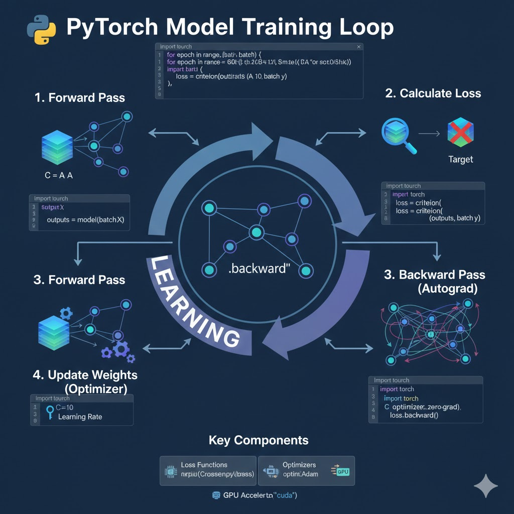

# PyTorch Training

> **Training neural networks** - The complete training loop

---

## 🖼️ Visual Architecture



## 🎯 Training Overview

Training a neural network involves:

1. **Forward pass**: Input → Model → Output
2. **Loss calculation**: Compare output with target
3. **Backward pass**: Compute gradients
4. **Weight update**: Adjust model parameters

```
┌─────────────────────────────────────────────────────────────┐
│                    Training Loop                             │
├─────────────────────────────────────────────────────────────┤
│                                                              │
│  for epoch in range(num_epochs):                            │
│      for batch in dataloader:                               │
│          1. Forward pass                                    │
│          2. Calculate loss                                  │
│          3. Backward pass (compute gradients)               │
│          4. Update weights                                  │
│                                                              │
└─────────────────────────────────────────────────────────────┘
```

---

## 📊 Complete Training Example

```python
import torch
import torch.nn as nn
import torch.optim as optim
from torch.utils.data import DataLoader, TensorDataset

# 1. Prepare Data
X_train = torch.randn(1000, 10)  # 1000 samples, 10 features
y_train = torch.randn(1000, 1)   # 1000 targets

# Create dataset and dataloader
dataset = TensorDataset(X_train, y_train)
dataloader = DataLoader(dataset, batch_size=32, shuffle=True)

# 2. Define Model
class SimpleModel(nn.Module):
    def __init__(self):
        super().__init__()
        self.fc1 = nn.Linear(10, 64)
        self.fc2 = nn.Linear(64, 32)
        self.fc3 = nn.Linear(32, 1)
        self.relu = nn.ReLU()

    def forward(self, x):
        x = self.relu(self.fc1(x))
        x = self.relu(self.fc2(x))
        x = self.fc3(x)
        return x

model = SimpleModel()

# 3. Loss Function and Optimizer
criterion = nn.MSELoss()
optimizer = optim.Adam(model.parameters(), lr=0.001)

# 4. Training Loop
num_epochs = 100

for epoch in range(num_epochs):
    epoch_loss = 0

    for batch_X, batch_y in dataloader:
        # Forward pass
        outputs = model(batch_X)
        loss = criterion(outputs, batch_y)

        # Backward pass
        optimizer.zero_grad()  # Clear previous gradients
        loss.backward()        # Compute gradients
        optimizer.step()       # Update weights

        epoch_loss += loss.item()

    # Print progress
    if (epoch + 1) % 10 == 0:
        avg_loss = epoch_loss / len(dataloader)
        print(f'Epoch [{epoch+1}/{num_epochs}], Loss: {avg_loss:.4f}')
```

---

## 🔧 Key Components

### 1. Loss Functions

```python
# Regression
criterion = nn.MSELoss()           # Mean Squared Error
criterion = nn.L1Loss()            # Mean Absolute Error

# Classification
criterion = nn.CrossEntropyLoss()  # Multi-class
criterion = nn.BCELoss()           # Binary (with sigmoid)
criterion = nn.BCEWithLogitsLoss() # Binary (without sigmoid)
```

---

### 2. Optimizers

```python
# Stochastic Gradient Descent
optimizer = optim.SGD(model.parameters(), lr=0.01, momentum=0.9)

# Adam (most popular)
optimizer = optim.Adam(model.parameters(), lr=0.001)

# AdamW (Adam with weight decay)
optimizer = optim.AdamW(model.parameters(), lr=0.001, weight_decay=0.01)

# RMSprop
optimizer = optim.RMSprop(model.parameters(), lr=0.001)
```

---

### 3. Learning Rate Scheduling

```python
from torch.optim.lr_scheduler import StepLR, ReduceLROnPlateau

# Reduce LR every 30 epochs
scheduler = StepLR(optimizer, step_size=30, gamma=0.1)

# Reduce LR when loss plateaus
scheduler = ReduceLROnPlateau(optimizer, mode='min', patience=10)

# Training loop with scheduler
for epoch in range(num_epochs):
    train_one_epoch()

    # Step scheduler
    scheduler.step()  # For StepLR
    # scheduler.step(val_loss)  # For ReduceLROnPlateau
```

---

## 📊 Training with Validation

```python
def train_epoch(model, dataloader, criterion, optimizer):
    """Train for one epoch"""
    model.train()  # Set to training mode
    total_loss = 0

    for batch_X, batch_y in dataloader:
        # Forward
        outputs = model(batch_X)
        loss = criterion(outputs, batch_y)

        # Backward
        optimizer.zero_grad()
        loss.backward()
        optimizer.step()

        total_loss += loss.item()

    return total_loss / len(dataloader)

def validate(model, dataloader, criterion):
    """Validate model"""
    model.eval()  # Set to evaluation mode
    total_loss = 0

    with torch.no_grad():  # Disable gradient computation
        for batch_X, batch_y in dataloader:
            outputs = model(batch_X)
            loss = criterion(outputs, batch_y)
            total_loss += loss.item()

    return total_loss / len(dataloader)

# Training loop with validation
for epoch in range(num_epochs):
    train_loss = train_epoch(model, train_loader, criterion, optimizer)
    val_loss = validate(model, val_loader, criterion)

    print(f'Epoch {epoch+1}: Train Loss: {train_loss:.4f}, Val Loss: {val_loss:.4f}')
```

---

## 💾 Saving and Loading Models

```python
# Save model
torch.save(model.state_dict(), 'model.pt')

# Save entire checkpoint
checkpoint = {
    'epoch': epoch,
    'model_state_dict': model.state_dict(),
    'optimizer_state_dict': optimizer.state_dict(),
    'loss': loss,
}
torch.save(checkpoint, 'checkpoint.pt')

# Load model
model = SimpleModel()
model.load_state_dict(torch.load('model.pt'))
model.eval()

# Load checkpoint
checkpoint = torch.load('checkpoint.pt')
model.load_state_dict(checkpoint['model_state_dict'])
optimizer.load_state_dict(checkpoint['optimizer_state_dict'])
epoch = checkpoint['epoch']
loss = checkpoint['loss']
```

---

## 📈 Tracking Metrics

```python
class MetricsTracker:
    def __init__(self):
        self.train_losses = []
        self.val_losses = []
        self.train_accs = []
        self.val_accs = []

    def update(self, train_loss, val_loss, train_acc, val_acc):
        self.train_losses.append(train_loss)
        self.val_losses.append(val_loss)
        self.train_accs.append(train_acc)
        self.val_accs.append(val_acc)

    def plot(self):
        import matplotlib.pyplot as plt

        plt.figure(figsize=(12, 4))

        # Plot losses
        plt.subplot(1, 2, 1)
        plt.plot(self.train_losses, label='Train Loss')
        plt.plot(self.val_losses, label='Val Loss')
        plt.xlabel('Epoch')
        plt.ylabel('Loss')
        plt.legend()

        # Plot accuracies
        plt.subplot(1, 2, 2)
        plt.plot(self.train_accs, label='Train Acc')
        plt.plot(self.val_accs, label='Val Acc')
        plt.xlabel('Epoch')
        plt.ylabel('Accuracy')
        plt.legend()

        plt.show()

# Usage
tracker = MetricsTracker()

for epoch in range(num_epochs):
    train_loss = train_epoch(...)
    val_loss = validate(...)
    train_acc = calculate_accuracy(...)
    val_acc = calculate_accuracy(...)

    tracker.update(train_loss, val_loss, train_acc, val_acc)

tracker.plot()
```

---

## 🎯 Early Stopping

```python
class EarlyStopping:
    def __init__(self, patience=10, min_delta=0):
        self.patience = patience
        self.min_delta = min_delta
        self.counter = 0
        self.best_loss = None
        self.early_stop = False

    def __call__(self, val_loss):
        if self.best_loss is None:
            self.best_loss = val_loss
        elif val_loss > self.best_loss - self.min_delta:
            self.counter += 1
            if self.counter >= self.patience:
                self.early_stop = True
        else:
            self.best_loss = val_loss
            self.counter = 0

# Usage
early_stopping = EarlyStopping(patience=10)

for epoch in range(num_epochs):
    train_loss = train_epoch(...)
    val_loss = validate(...)

    early_stopping(val_loss)
    if early_stopping.early_stop:
        print(f"Early stopping at epoch {epoch+1}")
        break
```

---

## 🚀 GPU Training

```python
# Check for GPU
device = torch.device('cuda' if torch.cuda.is_available() else 'cpu')
print(f'Using device: {device}')

# Move model to GPU
model = model.to(device)

# Training loop with GPU
for batch_X, batch_y in dataloader:
    # Move data to GPU
    batch_X = batch_X.to(device)
    batch_y = batch_y.to(device)

    # Forward pass (on GPU)
    outputs = model(batch_X)
    loss = criterion(outputs, batch_y)

    # Backward pass
    optimizer.zero_grad()
    loss.backward()
    optimizer.step()
```

---

## 💡 Best Practices

### 1. Always Use `model.train()` and `model.eval()`

```python
# Training
model.train()
for batch in train_loader:
    # Training code

# Evaluation
model.eval()
with torch.no_grad():
    for batch in val_loader:
        # Evaluation code
```

---

### 2. Use `torch.no_grad()` for Inference

```python
# Saves memory and computation
with torch.no_grad():
    predictions = model(test_data)
```

---

### 3. Clear Gradients Before Backward Pass

```python
# Always do this!
optimizer.zero_grad()
loss.backward()
optimizer.step()
```

---

### 4. Monitor Both Train and Validation Loss

```python
# Detect overfitting
if val_loss > train_loss:
    print("Model might be overfitting!")
```

---

## 📝 Quick Reference

| Component               | Purpose                |
| ----------------------- | ---------------------- |
| `model.train()`         | Enable training mode   |
| `model.eval()`          | Enable evaluation mode |
| `optimizer.zero_grad()` | Clear gradients        |
| `loss.backward()`       | Compute gradients      |
| `optimizer.step()`      | Update weights         |
| `torch.no_grad()`       | Disable gradients      |
| `torch.save()`          | Save model             |
| `torch.load()`          | Load model             |

---

## 🎯 Complete Training Template

```python
def train_model(model, train_loader, val_loader, num_epochs=100):
    """Complete training function"""
    device = torch.device('cuda' if torch.cuda.is_available() else 'cpu')
    model = model.to(device)

    criterion = nn.CrossEntropyLoss()
    optimizer = optim.Adam(model.parameters(), lr=0.001)
    scheduler = StepLR(optimizer, step_size=30, gamma=0.1)
    early_stopping = EarlyStopping(patience=10)

    for epoch in range(num_epochs):
        # Train
        model.train()
        train_loss = 0
        for batch_X, batch_y in train_loader:
            batch_X, batch_y = batch_X.to(device), batch_y.to(device)

            outputs = model(batch_X)
            loss = criterion(outputs, batch_y)

            optimizer.zero_grad()
            loss.backward()
            optimizer.step()

            train_loss += loss.item()

        # Validate
        model.eval()
        val_loss = 0
        with torch.no_grad():
            for batch_X, batch_y in val_loader:
                batch_X, batch_y = batch_X.to(device), batch_y.to(device)
                outputs = model(batch_X)
                loss = criterion(outputs, batch_y)
                val_loss += loss.item()

        # Print progress
        train_loss /= len(train_loader)
        val_loss /= len(val_loader)
        print(f'Epoch {epoch+1}: Train: {train_loss:.4f}, Val: {val_loss:.4f}')

        # Step scheduler
        scheduler.step()

        # Early stopping
        early_stopping(val_loss)
        if early_stopping.early_stop:
            print("Early stopping!")
            break

    return model
```

---

_Previous: [← Neural Networks](./03_neural_networks.md) | Next: [Pre-trained Models →](./05_models.md)_
