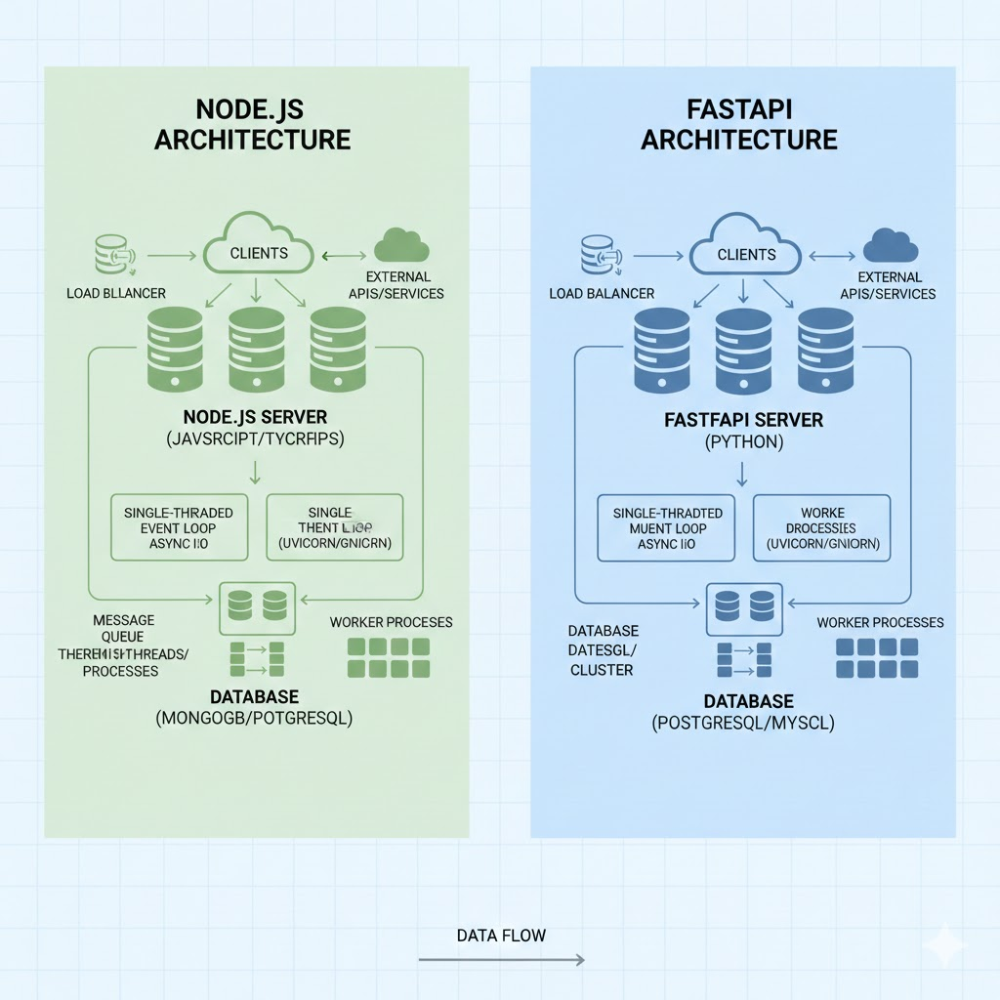

# FastAPI REST API Architecture

## Overview

This document explains the architecture of modern Python REST APIs using FastAPI, demonstrating how to build production-ready web services.

---

## 🖼️ Visual Architecture



## What is a REST API?

**REST** (Representational State Transfer) is an architectural style for building web services.

```
┌──────────────┐         HTTP Request          ┌──────────────┐
│              │  ────────────────────────────▶ │              │
│   Client     │                                │  REST API    │
│  (Browser/   │  ◀────────────────────────────  │  (FastAPI)   │
│   Mobile)    │         HTTP Response          │              │
└──────────────┘                                └──────────────┘
```

### HTTP Methods (Verbs)

| Method | Purpose              | Example                |
| ------ | -------------------- | ---------------------- |
| GET    | Retrieve data        | Get list of users      |
| POST   | Create new data      | Create a new user      |
| PUT    | Update existing data | Update user profile    |
| DELETE | Delete data          | Delete a user          |
| PATCH  | Partial update       | Update user email only |

---

## FastAPI Architecture Layers

```
┌─────────────────────────────────────────────────────────────┐
│                        Client Layer                          │
│  (Browser, Mobile App, Another API)                         │
└───────────────────────────┬─────────────────────────────────┘
                            │ HTTP Requests (JSON)
                            ▼
┌─────────────────────────────────────────────────────────────┐
│                    Middleware Layer                          │
│  • CORS (Cross-Origin Resource Sharing)                     │
│  • Error Handler (Global exception handling)                │
│  • Authentication (JWT, OAuth - if needed)                   │
└───────────────────────────┬─────────────────────────────────┘
                            │
                            ▼
┌─────────────────────────────────────────────────────────────┐
│                     Router Layer                             │
│  • Health Router (/health)                                   │
│  • External API Router (/api/v1/external)                    │
│  • Validates requests using Pydantic models                  │
└───────────────────────────┬─────────────────────────────────┘
                            │
                            ▼
┌─────────────────────────────────────────────────────────────┐
│                    Service Layer                             │
│  • Business logic                                            │
│  • External API integration                                  │
│  • Data transformation                                       │
└───────────────────────────┬─────────────────────────────────┘
                            │
                            ▼
┌─────────────────────────────────────────────────────────────┐
│                    Utility Layer                             │
│  • HTTP Client (httpx for async requests)                    │
│  • Logger (structured logging)                               │
│  • Configuration (environment variables)                     │
└───────────────────────────┬─────────────────────────────────┘
                            │
        ┌───────────────────┴───────────────────┐
        ▼                                       ▼
┌──────────────┐                       ┌──────────────┐
│ External APIs│                       │   Database   │
│ (HTTP)       │                       │   (Optional) │
└──────────────┘                       └──────────────┘
```

---

## Request Flow Example

### Example: GET /api/v1/external/posts

```
1. Client sends HTTP GET request
   GET http://localhost:8000/api/v1/external/posts?limit=5

2. Request enters FastAPI application
   ↓
3. CORS Middleware
   • Checks if request origin is allowed
   • Adds CORS headers to response
   ↓
4. Error Handler Middleware
   • Wraps request in try-catch
   • Catches any unhandled exceptions
   ↓
5. Router Layer (external_api.py)
   • Matches route: @router.get("/posts")
   • Validates query parameter: limit (using Pydantic)
   ↓
6. Route Handler
   async def get_posts(limit: int = 10):
       posts = await external_api_service.get_posts(limit)
       return posts
   ↓
7. Service Layer (external_api_service.py)
   • Calls external API (JSONPlaceholder)
   • Uses HTTP client to make async request
   ↓
8. HTTP Client (http_client.py)
   • Makes async HTTP request using httpx
   • Handles timeouts and errors
   ↓
9. External API Response
   • Receives JSON data from JSONPlaceholder
   ↓
10. Service Layer
    • Transforms JSON into Pydantic models (List[Post])
    • Validates data structure
    ↓
11. Router Layer
    • Returns List[Post] to FastAPI
    ↓
12. FastAPI
    • Serializes Pydantic models to JSON
    • Adds response headers
    ↓
13. Client receives response
    HTTP 200 OK
    Content-Type: application/json
    [
      {"userId": 1, "id": 1, "title": "...", "body": "..."},
      ...
    ]
```

---

## Project Structure

```
fastapi-starter/
├── app/
│   ├── main.py                  # 🚀 Application entry point
│   ├── config.py                # ⚙️  Configuration management
│   ├── routes/                  # 🛣️  API route handlers
│   │   ├── health.py            # Health check endpoints
│   │   └── external_api.py      # External API integration
│   ├── controllers/             # 🎮 Request handlers
│   │   ├── health_controller.py
│   │   └── external_controller.py
│   ├── services/                # 💼 Business logic layer
│   │   └── external_api_service.py
│   ├── helpers/                 # 🔧 Utility functions
│   │   ├── logger.py            # Logging configuration
│   │   └── http_client.py       # HTTP client wrapper
│   └── middleware/              # 🛡️  Custom middleware
│       └── error_handler.py     # Global error handling
├── tests/                       # 🧪 Test suite
│   └── test_api.py
├── pyproject.toml               # 📦 UV package configuration
└── README.md                    # 📖 Documentation
```

---

## Key Components Explained

### 1. **Routers** (Route Handlers)

Define API endpoints and handle HTTP requests.

```python
# app/routers/health.py
from fastapi import APIRouter

router = APIRouter(prefix="/health", tags=["Health"])

@router.get("")
async def health_check():
    """Basic health check endpoint"""
    return {"status": "healthy", "timestamp": datetime.now()}
```

**Purpose**:

- Define API routes
- Validate request data
- Call service layer
- Return responses

---

### 2. **Pydantic Models** (Data Validation)

Define data structures with automatic validation.

```python
# app/models/external.py
from pydantic import BaseModel, Field

class WeatherRequest(BaseModel):
    latitude: float = Field(..., ge=-90, le=90)
    longitude: float = Field(..., ge=-180, le=180)
```

**Benefits**:

- Automatic validation
- Type safety
- Auto-generated API documentation
- Serialization/deserialization

---

### 3. **Services** (Business Logic)

Implement business logic and external integrations.

```python
# app/services/external_api_service.py
class ExternalAPIService:
    async def get_posts(self, limit: int) -> List[Post]:
        url = f"{settings.JSONPLACEHOLDER_URL}/posts"
        data = await http_client.get(url)
        return [Post(**post) for post in data[:limit]]
```

**Purpose**:

- Separate business logic from routes
- Reusable code
- Easy to test
- Maintainable

---

### 4. **Middleware** (Request/Response Processing)

Process requests before they reach routes.

```python
# app/middleware/error_handler.py
async def error_handler_middleware(request, call_next):
    try:
        return await call_next(request)
    except Exception as e:
        logger.error(f"Error: {e}")
        return JSONResponse(
            status_code=500,
            content={"error": "Internal Server Error"}
        )
```

**Use cases**:

- Error handling
- Authentication
- Logging
- CORS

---

## Modern Python Package Management with UV

### Traditional Way (requirements.txt)

```bash
# Old way
pip install fastapi uvicorn
pip freeze > requirements.txt
pip install -r requirements.txt
```

### Modern Way (UV + pyproject.toml)

```toml
# pyproject.toml
[project]
name = "fastapi-starter"
dependencies = [
    "fastapi>=0.109.0",
    "uvicorn[standard]>=0.27.0",
    "httpx>=0.26.0",
]
```

```bash
# New way
uv sync                    # Install all dependencies
uv add package-name        # Add new dependency
uv run uvicorn app.main:app  # Run application
```

**Benefits of UV**:

- ⚡ **Faster**: 10-100x faster than pip
- 🔒 **Lockfile**: Reproducible builds
- 📦 **Modern**: Single tool for everything
- 🎯 **Simple**: No virtual environment management needed

---

## Async/Await in Python

### Why Async?

**Synchronous (Blocking)**:

```python
def fetch_data():
    response = requests.get(url)  # Waits here (blocks)
    return response
```

**Asynchronous (Non-blocking)**:

```python
async def fetch_data():
    response = await http_client.get(url)  # Doesn't block
    return response
```

### Benefits

- **Concurrent requests**: Handle multiple requests at once
- **Better performance**: Especially for I/O-bound operations
- **Scalability**: Handle more users with same resources

---

## API Documentation (Auto-generated)

FastAPI automatically generates interactive API documentation:

### Swagger UI

```
http://localhost:8000/docs
```

### ReDoc

```
http://localhost:8000/redoc
```

**Features**:

- Interactive testing
- Request/response examples
- Schema documentation
- Try out endpoints directly

---

## Comparison: Node.js vs Python FastAPI

| Aspect              | Node.js/Express             | Python/FastAPI         |
| ------------------- | --------------------------- | ---------------------- |
| **Routing**         | `app.get('/path', handler)` | `@router.get("/path")` |
| **Async**           | Promises/async-await        | async/await            |
| **Validation**      | Manual or Joi               | Built-in (Pydantic)    |
| **Type Safety**     | TypeScript (optional)       | Type hints (built-in)  |
| **Documentation**   | Manual or Swagger           | Auto-generated         |
| **Package Manager** | npm/yarn                    | UV/pip                 |
| **Performance**     | Very fast (V8 engine)       | Fast (async support)   |

---

## Best Practices

### ✅ Do

1. **Use type hints** everywhere
2. **Separate concerns** (routers, services, models)
3. **Validate data** with Pydantic
4. **Handle errors** properly
5. **Use async/await** for I/O operations
6. **Write tests** for all endpoints
7. **Document code** with docstrings
8. **Use environment variables** for configuration

### ❌ Don't

1. Don't put business logic in routers
2. Don't ignore error handling
3. Don't skip validation
4. Don't use blocking I/O in async functions
5. Don't hardcode configuration

---

## Example API Endpoints

### Health Check

```http
GET /health
Response: {"status": "healthy", "timestamp": "2026-02-08T13:00:00"}
```

### External API Integration

```http
GET /api/v1/external/posts?limit=5
Response: [{"userId": 1, "id": 1, "title": "...", "body": "..."}]
```

### Weather Data

```http
POST /api/v1/external/weather
Body: {"latitude": 13.0827, "longitude": 80.2707}
Response: {"temperature": 28.5, "windspeed": 12.3, ...}
```

---

## Further Reading

- [FastAPI Documentation](https://fastapi.tiangolo.com/)
- [Pydantic Documentation](https://docs.pydantic.dev/)
- [Python Async/Await](https://docs.python.org/3/library/asyncio.html)
- [UV Package Manager](https://github.com/astral-sh/uv)
- [REST API Best Practices](https://restfulapi.net/)

---

_This architecture demonstrates modern Python web development practices suitable for production applications._
