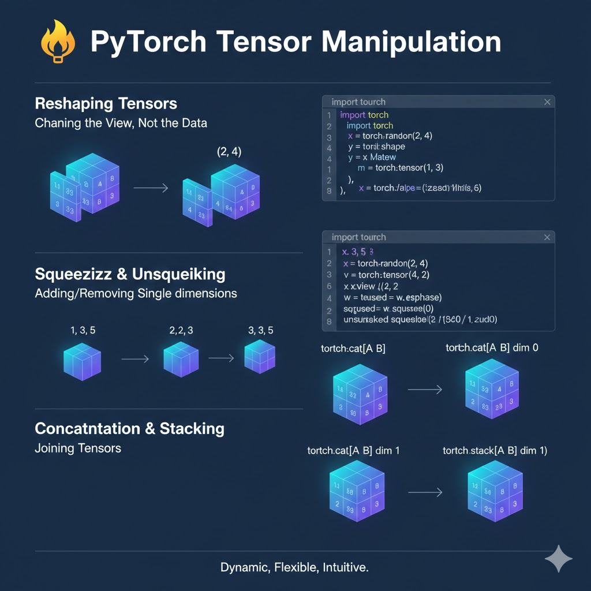

# 🔄 Tensor Manipulation

> Data almost never comes in the perfect shape for a neural network. Learning how to twist, turn, and reshape tensors is a core skill for any AI engineer.

---

## 🖼️ Visual Architecture



## 📐 Reshaping (view & reshape)

PyTorch provides two main ways to change the shape of a tensor.

### `view()` vs `reshape()`

- `view()`: Super fast, but requires the data to be stored contiguously in memory.
- `reshape()`: More robust, works even if the data is fragmented.

**Rule of thumb:** Use `reshape()` if you aren't sure.

```python
x = torch.arange(12) # [0, 1, 2, ... 11] (Shape: 12)

# Change to 3 rows, 4 columns
y = x.reshape(3, 4)

# Use -1 to let PyTorch calculate the dimension for you
z = x.reshape(2, -1) # Result: 2 rows, 6 columns
```

---

## 🤌 Squeeze & Unsqueeze

These methods are used to add or remove "batch" or "channel" dimensions.

### `unsqueeze(dim)` - Adding a dimension

Useful when you have a single sample but the model expects a batch.

```python
x = torch.tensor([1, 2, 3]) # Shape: (3)
y = x.unsqueeze(dim=0)      # Shape: (1, 3)
z = x.unsqueeze(dim=1)      # Shape: (3, 1)
```

### `squeeze()` - Removing dimensions of size 1

Useful for cleaning up output.

```python
x = torch.zeros(1, 3, 1)
y = x.squeeze() # Result Shape: (3)
```

---

## 🧱 Stacking & Concatenating

Sometimes you need to combine multiple tensors.

### `concatenate (cat)`

Glues tensors along an **existing** dimension.

```python
x = torch.tensor([[1, 2], [3, 4]])
y = torch.tensor([[5, 6]])
z = torch.cat((x, y), dim=0) # Stacks them vertically
```

### `stack`

Glues tensors along a **new** dimension (creates a 3D tensor from 2D ones).

```python
x = torch.tensor([1, 2, 3])
y = torch.tensor([4, 5, 6])
z = torch.stack([x, y]) # Shape: (2, 3)
```

---

_Next Up: [Tensor Math & Broadcasting](./03_tensor_math.md)_
