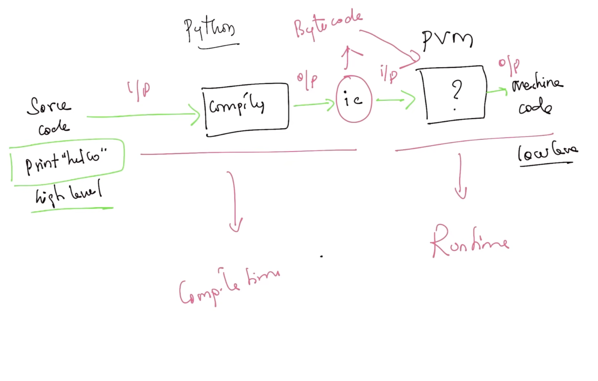

# 🎓 Python Learning Path

> **Welcome to the Python Starter Kit!** This guide is organized sequentially to take you from basics to advanced concepts. Follow the sequence below for the best learning experience.

---

## 🚀 Learning Sequence

| Step | Topic                       | 📖 Documentation                                    | 💻 Code Examples                                      |
| :--- | :-------------------------- | :-------------------------------------------------- | :---------------------------------------------------- |
| 00   | **Python Architecture**     | [Read Below](#python-architecture)                  | -                                                     |
| 01   | **Operators**               | [View Guide](./01_operators/index.md)               | [Explore Code](../starter_kit/01_operators/)          |
| 02   | **Strings**                 | [View Guide](./02_strings/index.md)                 | [Explore Code](../starter_kit/02_strings/)            |
| 03   | **Type Casting**            | [View Guide](./03_type_check_casting/index.md)      | [Explore Code](../starter_kit/03_type_check_casting/) |
| 04   | **User Input**              | [View Guide](./04_input/indexx.md)                  | [Explore Code](../starter_kit/04_input/)              |
| 05   | **Variable Scope**          | [View Guide](./05_variable_scope/index.md)          | [Explore Code](../starter_kit/05_variable_scope/)     |
| 06   | **Control Flow**            | [View Guide](./06_control_flow/index.md)            | [Explore Code](../starter_kit/06_control_flow/)       |
| 07   | **Functions**               | [View Guide](./07_functions/index.md)               | [Explore Code](../starter_kit/07_functions/)          |
| 08   | **Data Structures**         | [View Guide](./08_data_structures/index.md)         | [Explore Code](../starter_kit/08_data_structures/)    |
| 09   | **OOP Concepts**            | [View Guide](./09_oop/index.md)                     | [Explore Code](../starter_kit/09_oop/)                |
| 10   | **File Handling**           | [View Guide](./10_file_handling/index.md)           | [Explore Code](../starter_kit/10_file_handling/)      |
| 11   | **Exception Handling**      | [View Guide](./11_exception_handling/index.md)      | [Explore Code](../starter_kit/11_exception_handling/) |
| 12   | **PEP-8 Style Guide**       | [View Guide](./12_pep8/index.md)                    | -                                                     |
| 13   | **FastAPI REST API**        | [View Guide](./13_fastapi_rest_api/index.md)        | [Explore Code](../fastapi-starter/)                   |
| 14   | **PySpark Data Processing** | [View Guide](./14_pyspark_data_processing/index.md) | [Explore Code](../data-pipeline/)                     |
| 15   | **PyTorch ML**              | [View Guide](./15_pytorch_ml/index.md)              | [Explore Code](../starter_kit/15_pytorch_ml/)         |
| 16   | **Full-Stack Architecture** | [View Guide](./16_fullstack_architecture/index.md)  | [Explore Code](../frontend/)                          |

---

<div id="python-architecture"></div>

# 🐍 Python Architecture

> **How Python runs your code** - explained visually

---

## 📚 Two Types of Languages

```
┌─────────────────────────────────────────────────────────────┐
│                                                             │
│  HLL (High-Level Language)        LLL (Low-Level Language) │
│  ✍️  Human-Readable                🤖 Machine-Readable      │
│                                                             │
│  Example: Python, Java            Example: 0101010101      │
│                                                             │
└─────────────────────────────────────────────────────────────┘
```

---

## 🔄 How Code Runs

### Traditional Languages (C, C++)

```
📝 Source Code  →  🔨 Compiler  →  ⚙️  Machine Code  →  ✅ Run
   (You write)      (Translates)     (Computer runs)
```

### Python's Way

```
📝 Source Code  →  🔨 Compiler  →  📦 Bytecode  →  🐍 PVM  →  ⚙️  Machine Code  →  ✅ Run
   (You write)      (Translates)    (.pyc file)   (Interprets)  (Computer runs)
```

---

## 🎯 Python Execution in 2 Phases

### Example: `print("Hello")`

```
┌──────────────────────────────────────────────────────────────┐
│                    ⏱️  COMPILE TIME                          │
├──────────────────────────────────────────────────────────────┤
│                                                              │
│   print("Hello")  →  Compiler  →  Bytecode (.pyc)          │
│                                                              │
│   ✓ Check syntax                                            │
│   ✓ Convert to intermediate code                            │
│                                                              │
└──────────────────────────────────────────────────────────────┘

┌──────────────────────────────────────────────────────────────┐
│                    🚀 RUNTIME                                │
├──────────────────────────────────────────────────────────────┤
│                                                              │
│   Bytecode  →  PVM  →  Machine Code  →  Output: Hello      │
│                                                              │
│   ✓ Load bytecode                                           │
│   ✓ Interpret line-by-line                                  │
│   ✓ Execute on CPU                                          │
│                                                              │
└──────────────────────────────────────────────────────────────┘
```

---

## 🖼️ Visual Architecture



### Legend

| Symbol | Meaning                             |
| ------ | ----------------------------------- |
| 📝     | Your Python code (.py file)         |
| 🔨     | Compiler (converts to bytecode)     |
| 📦     | Bytecode (.pyc - intermediate code) |
| 🐍     | PVM (Python Virtual Machine)        |
| ⚙️     | Machine code (runs on CPU)          |

---

## 💡 Key Points

```
✅ Python = Compiler + Interpreter (hybrid)
✅ Bytecode = Platform-independent (works anywhere)
✅ PVM = Translates bytecode to machine code
✅ Two phases = Compile time + Runtime
```

---

## 🔍 Quick Comparison

| Feature       | Traditional (C/C++)  | Python                  |
| ------------- | -------------------- | ----------------------- |
| **Steps**     | 1 (Direct compile)   | 2 (Compile → Interpret) |
| **Output**    | Machine code         | Bytecode → Machine code |
| **Portable?** | ❌ Platform-specific | ✅ Cross-platform       |
| **Speed**     | ⚡ Faster            | 🐢 Slower (but easier)  |

---

## 🌍 Platform Independent

**Write Once, Run Anywhere!**


### How It Works

```
Same Python Code (.py)
         ↓
   Same Bytecode (.pyc)
         ↓
    ┌────┴────┬────────┬────────┐
    ↓         ↓        ↓        ↓
  Windows   macOS   Linux   Any OS
    ↓         ↓        ↓        ↓
  Intel     ARM      AMD    Any CPU
    ↓         ↓        ↓        ↓
   ✅ Works  ✅ Works ✅ Works ✅ Works
```

**Key Benefit:** Python bytecode runs on any OS/Processor with Python installed!

---

_Updated: Feb 2026_
